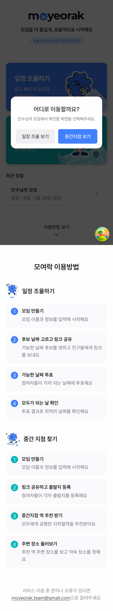

# 최근 모임 플로우 분기 - 백엔드 구현 결과

- 날짜: 2026-07-26
- 상태: 구현 및 검증 완료
- 대상 레포: `dnd-14th-8-backend`
- 연관 이슈: https://github.com/dnd-side-project/dnd-14th-8-backend/issues/164
- 연관 프론트 이슈: https://github.com/dnd-side-project/dnd-14th-8-frontend/issues/156

## 구현 배경

프론트 최근 모임 카드는 모임별로 일정 조율 화면 또는 중간지점 화면으로 분기해야 한다. 기존 `GET /api/meetings/me` 응답에는 플로우 판단 정보가 없어 프론트가 항상 일정 화면으로 이동했다.

백엔드는 모든 모임 생성 시 `SchedulePoll`과 `LocationPoll`을 둘 다 만든다. 따라서 poll 존재 여부로 판단하면 모든 모임이 일정/위치 모두 가능한 것으로 오판된다. 이번 구현에서는 최초 생성 플로우와 실제 사용 데이터를 함께 사용해 `availableFlows`를 계산했다.

## 캡처

백엔드 응답의 `availableFlows: ["SCHEDULE", "LOCATION"]`를 받은 프론트 선택 UI 캡처다.



## API 변경

### 요청

`POST /api/meetings` 요청에 `flow`를 추가했다.

```json
{
  "participantCount": 4,
  "localStorageKey": "session-key",
  "participantName": "민수",
  "flow": "LOCATION"
}
```

하위 호환을 위해 `flow`가 없으면 `SCHEDULE`로 처리한다.

### 응답

`GET /api/meetings/me` 응답에 `availableFlows`를 추가했다.

```json
{
  "meetingId": "abc123",
  "hostName": "민수",
  "participantCount": 4,
  "createdAt": "2026-07-26T14:10:00",
  "isHost": true,
  "availableFlows": ["SCHEDULE", "LOCATION"]
}
```

## 백엔드 변경 사항

### 1. `MeetingFlow` enum 추가

```java
public enum MeetingFlow {
    SCHEDULE,
    LOCATION
}
```

### 2. `Meeting.initialFlow` 추가

모임 생성 시 사용자가 선택한 최초 플로우를 저장한다.

```java
@Column(name = "initial_flow", nullable = false)
@Enumerated(EnumType.STRING)
private MeetingFlow initialFlow = MeetingFlow.SCHEDULE;
```

### 3. Flyway 마이그레이션 추가

`V5__add_meeting_initial_flow.sql`

```sql
ALTER TABLE meeting
    ADD COLUMN initial_flow varchar(255) NOT NULL DEFAULT 'SCHEDULE';
```

기존 데이터는 `SCHEDULE` 기본값으로 유지한다.

### 4. `availableFlows` 계산

계산 기준:

| 조건 | 추가 플로우 |
|---|---|
| `initialFlow == SCHEDULE` | `SCHEDULE` |
| `initialFlow == LOCATION` | `LOCATION` |
| 일정 투표 존재 또는 일정 확정 | `SCHEDULE` |
| 위치 투표 존재 | `LOCATION` |

poll 존재 여부는 계산 기준으로 사용하지 않는다.

### 5. 조회 쿼리 보강

`ParticipantRepository.findAllByLocalStorageKeyWithMeetingAndParticipants`에서 meeting의 schedule/location poll을 함께 fetch join 하도록 보강했다.

## 주요 수정 파일

- `src/main/java/com/dnd/moyeolak/domain/meeting/enums/MeetingFlow.java`
- `src/main/java/com/dnd/moyeolak/domain/meeting/dto/CreateMeetingRequest.java`
- `src/main/java/com/dnd/moyeolak/domain/meeting/dto/MyMeetingResponse.java`
- `src/main/java/com/dnd/moyeolak/domain/meeting/entity/Meeting.java`
- `src/main/java/com/dnd/moyeolak/domain/meeting/service/impl/MeetingServiceImpl.java`
- `src/main/java/com/dnd/moyeolak/domain/participant/repository/ParticipantRepository.java`
- `src/main/resources/db/migration/V5__add_meeting_initial_flow.sql`
- `src/main/resources/data.sql`

## 테스트 추가 및 수정

- `MeetingControllerTest`
  - `/api/meetings/me` 응답에 `availableFlows` 포함 검증
- `MeetingServiceUnitTest`
  - 기본 schedule flow 검증
  - location 생성 모임의 location-only flow 검증
  - 일정/위치 투표가 모두 있는 경우 복수 flow 검증
- `PostgisFlywayMigrationTest`
  - Flyway 현재 버전을 `5`로 갱신

## 검증 결과

```bash
./gradlew test
```

- 결과: 성공
- 테스트: 213 tests 통과

```bash
git diff --check
```

- 결과: 성공

## 남은 주의점

- 운영 DB에는 `V5__add_meeting_initial_flow.sql` 적용이 필요하다.
- 기존 모임은 `initial_flow = SCHEDULE`로 채워진다. 기존 location-only 모임을 더 정확히 복원하려면 과거 location vote 데이터 기반 보정 마이그레이션을 별도 검토할 수 있다.
- 프론트는 `availableFlows` 누락 시 일정 화면으로 fallback하므로 백엔드/프론트 배포 순서 차이를 흡수한다.
