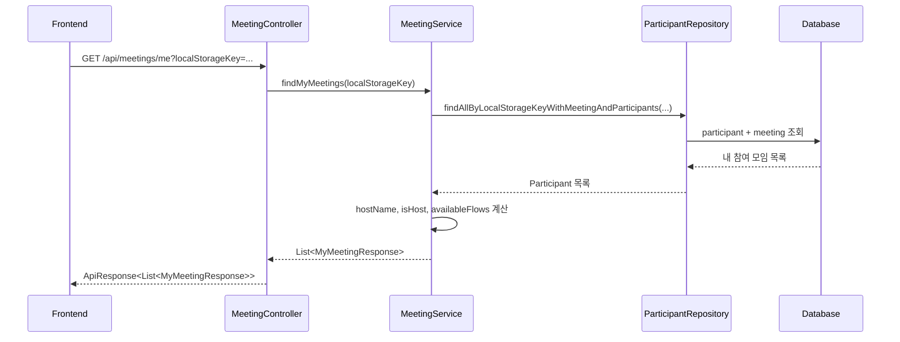
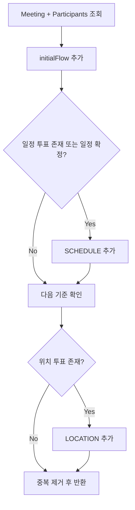

# 최근 모임 플로우 분기 - 백엔드 설계

- 날짜: 2026-07-26
- 상태: 설계 완료, 구현 예정
- 대상 레포: `dnd-14th-8-backend`
- 연관 레포: `dnd-14th-8-frontend` (같은 날짜 `최근-모임-플로우-분기-프론트-설계.md`)
- 결정안: `GET /api/meetings/me` 응답에 최근 모임 진입 가능한 플로우 목록을 추가한다.

## 배경

프론트 랜딩 홈의 최근 모임은 현재 모임 카드 클릭 시 항상 일정 조율 화면으로 이동한다. 하지만 모임은 일정 조율만 진행한 경우, 중간지점 찾기만 진행한 경우, 두 기능을 모두 진행한 경우가 있다.

프론트가 올바르게 라우팅하려면 최근 모임 목록 응답에서 모임별 사용 가능 플로우를 내려줘야 한다.

## 현재 상태

| 항목 | 상태 |
|---|---|
| 최근 모임 API | `GET /api/meetings/me?localStorageKey=...` |
| 응답 DTO | `MyMeetingResponse` |
| 응답 필드 | `meetingId`, `hostName`, `participantCount`, `createdAt`, `isHost` |
| 모임 생성 | 생성 시 `SchedulePoll`, `LocationPoll`을 항상 둘 다 생성 |
| 내 참여자 조회 | `ParticipantResponse`에는 `scheduleVoteId`, `locationVoteId`가 있음 |

중요한 제약은 poll 존재 여부로 기능 사용 여부를 판단할 수 없다는 점이다. `MeetingServiceImpl.createMeeting`은 모든 모임에 일정 poll과 위치 poll을 기본 생성하므로, poll 존재 여부를 기준으로 삼으면 모든 모임이 두 플로우를 가진 것처럼 보인다.

## API 계약 변경

`MyMeetingResponse`에 `availableFlows`를 추가한다.

```java
public enum MeetingFlow {
    SCHEDULE,
    LOCATION
}
```

```java
public record MyMeetingResponse(
        String meetingId,
        String hostName,
        int participantCount,
        LocalDateTime createdAt,
        boolean isHost,
        List<MeetingFlow> availableFlows
) {
}
```

응답 예시:

```json
{
  "code": "SUCCESS",
  "message": "요청이 성공했습니다.",
  "data": [
    {
      "meetingId": "abc123",
      "hostName": "민수",
      "participantCount": 4,
      "createdAt": "2026-07-26T14:10:00",
      "isHost": true,
      "availableFlows": ["SCHEDULE", "LOCATION"]
    }
  ]
}
```

## 플로우 판단 기준

정확한 분기를 위해서는 생성 목적과 실제 사용 데이터를 함께 봐야 한다.

| 기준 | 설명 |
|---|---|
| 최초 생성 플로우 | `/new/schedule`, `/new/location`에서 선택한 생성 목적 |
| 일정 사용 데이터 | 모임에 일정 투표가 존재하거나 일정 poll이 확정됨 |
| 위치 사용 데이터 | 모임에 출발지 투표가 존재함 |

권장 계산식:

```text
availableFlows =
  최초 생성 플로우
  + 일정 투표 또는 일정 확정이 있으면 SCHEDULE
  + 위치 투표가 있으면 LOCATION
```

이 방식이면 생성 직후 아직 투표가 없는 모임도 올바른 화면으로 보낼 수 있다.

## 데이터 모델 변경안

`Meeting`에 최초 생성 플로우를 저장한다.

```java
@Enumerated(EnumType.STRING)
@Column(name = "initial_flow", nullable = false)
private MeetingFlow initialFlow;
```

`CreateMeetingRequest`에 `flow`를 추가한다.

```java
public record CreateMeetingRequest(
        Integer participantCount,
        String participantName,
        String localStorageKey,
        MeetingFlow flow
) {
}
```

하위 호환이 필요하면 `flow`가 null일 때 `SCHEDULE`을 기본값으로 둔다. 기존 운영 데이터도 마이그레이션에서 `SCHEDULE` 기본값을 넣으면 기존 동작과 충돌하지 않는다.

## 조회 흐름



## 계산 흐름



## Repository 고려 사항

현재 `ParticipantRepository.findAllByLocalStorageKeyWithMeetingAndParticipants`는 내 참여자와 모임 참가자 목록만 fetch join 한다. `availableFlows` 계산에서 각 참여자의 일정/위치 투표 목록을 순회하면 lazy loading이 추가로 발생할 수 있다.

선택지:

1. 1차 구현은 현재 조회를 유지하고 `@BatchSize`에 기대어 계산한다.
2. 성능을 더 엄격히 보려면 모임별 schedule vote count, location vote count를 projection 쿼리로 조회한다.

최근 모임은 프론트에서 최대 5개만 노출하므로 1차는 단순 구현을 우선하고, 운영 데이터가 늘면 projection으로 최적화한다.

## 구현 범위

수정 대상:

- `domain.meeting.dto.MyMeetingResponse`
- `domain.meeting.dto.CreateMeetingRequest`
- `domain.meeting.entity.Meeting`
- `domain.meeting.service.impl.MeetingServiceImpl`
- 필요 시 `domain.meeting.enums.MeetingFlow` 신규
- DB 마이그레이션 또는 스키마 업데이트
- Controller/Service 테스트

## 테스트 계획

### Service 테스트

- 최초 생성 플로우가 `SCHEDULE`이고 투표가 없으면 `availableFlows = ["SCHEDULE"]`
- 최초 생성 플로우가 `LOCATION`이고 출발지가 없으면 `availableFlows = ["LOCATION"]`
- 일정 투표와 위치 투표가 모두 있으면 두 플로우를 모두 반환한다.
- poll만 존재하고 사용 데이터가 없을 때는 poll 존재만으로 두 플로우를 반환하지 않는다.
- 기존 데이터처럼 `flow`가 비어 있는 경우 기본값을 적용한다.

### Controller 테스트

- `/api/meetings/me` 응답에 `availableFlows`가 포함된다.
- `availableFlows`가 단일 플로우일 때 배열 형태로 반환된다.
- `availableFlows`가 복수 플로우일 때 배열 형태로 반환된다.

## 리스크와 대응

| 리스크 | 대응 |
|---|---|
| 기존 운영 데이터에 최초 생성 플로우가 없음 | 마이그레이션 기본값 `SCHEDULE` 적용 |
| poll 존재 여부로 오판 | 판단 기준을 initialFlow + 실제 vote 데이터로 제한 |
| 추가 lazy loading | 최근 목록 규모가 작아 1차 수용, 필요 시 projection 쿼리로 개선 |
| 프론트/백엔드 배포 순서 차이 | 프론트는 `availableFlows` 누락 시 일정 화면으로 폴백 |

## 구현 순서 초안

1. `MeetingFlow` enum 추가
2. `Meeting.initialFlow` 필드와 생성 팩토리 반영
3. `CreateMeetingRequest.flow` 추가 및 null 기본값 처리
4. `MyMeetingResponse.availableFlows` 추가
5. `MeetingServiceImpl.findMyMeetings`에서 플로우 계산
6. Service/Controller 테스트 추가
7. 프론트 계약 반영 후 통합 검증
