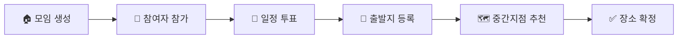
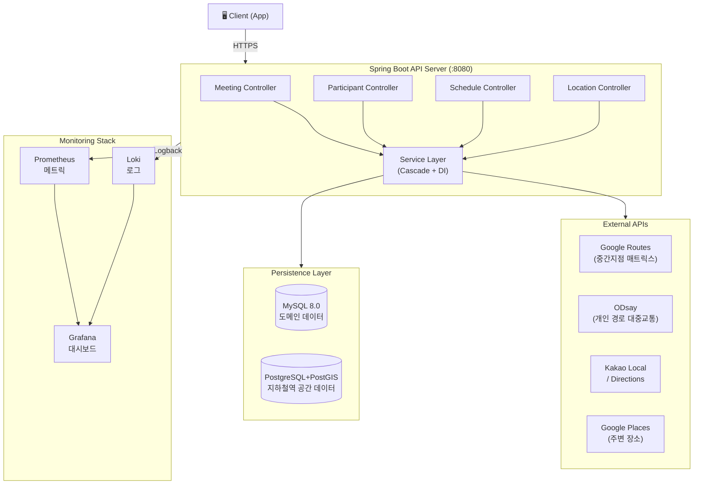
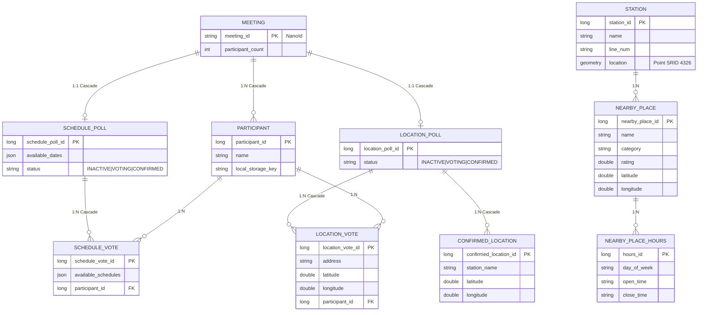
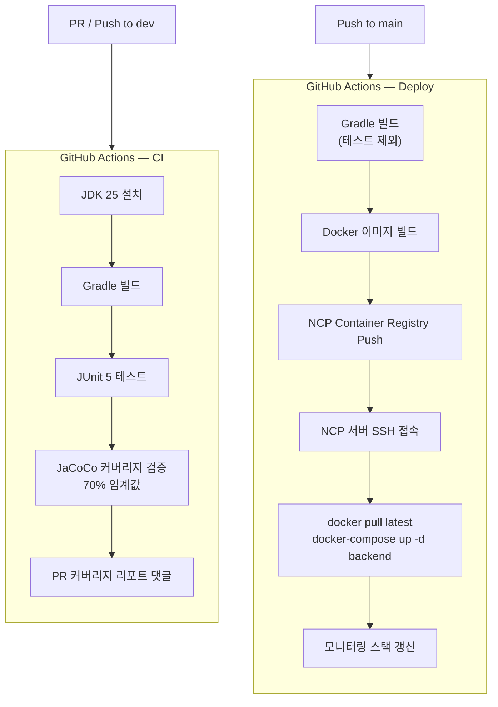
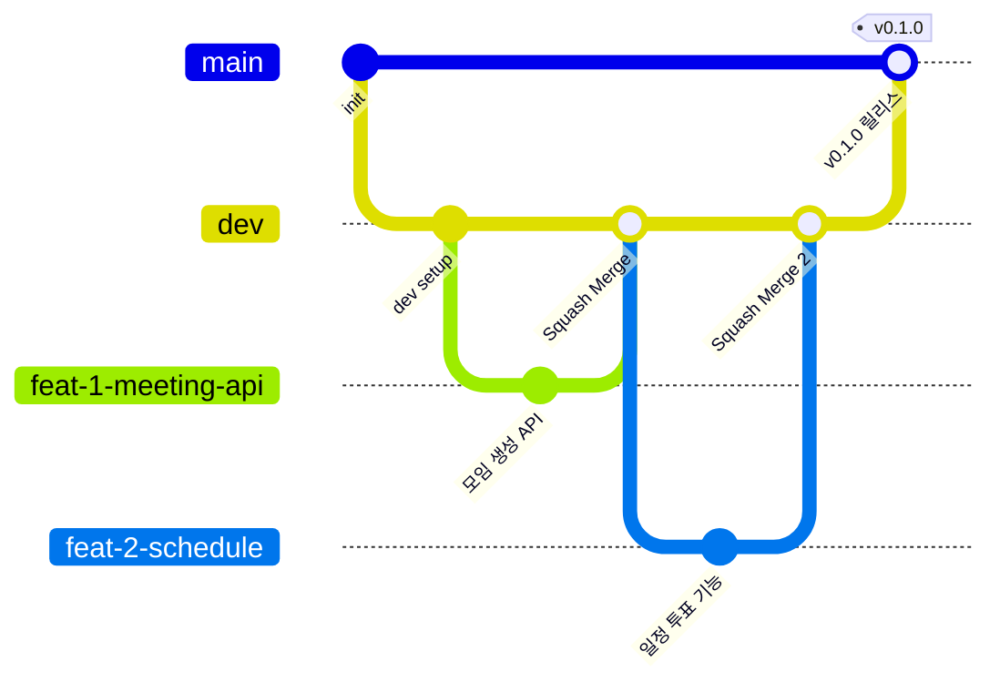

<div align="center">

# 🗺️ 모여락 (Moyeolak)

### 우리, 딱 중간에서 만나자

로그인 없이 모임을 만들고, 일정과 출발지를 투표로 정하고, **중간 지점 역**을 자동으로 추천받는 모임 조율 서비스

<br/>


</div>

<br/>

## 🧑‍💻 Backend 팀원 소개

| 백도현 (팀장) | 장현호 |
|:---:|:---:|
| [BaekDoHyeon](https://github.com/BaekDoHyeon) | [hyunolike](https://github.com/hyunolike) |
|  |  |

<br/>

## 🎯 서비스 소개

**모여락**은 로그인 없이 사용 가능한 **모임 장소 자동 추천 서비스**입니다.

> "어디서 만날까?" 고민하는 시간을 없애드립니다.

1. **모임 생성** — 링크 하나로 참여자 모집, 별도 회원가입 불필요
2. **일정 투표** — 참여자 각자 가능한 날짜를 선택해 최적 일정 합의
3. **출발지 등록** — 각자의 출발지를 지도에서 등록
4. **중간 지점 추천** — 출발지 좌표의 지리적 중심 기반으로 인근 지하철역을 탐색하고, Google Distance Matrix API로 이동시간을 계산해 **총 이동시간 합이 최소인 역 Top 3** 추천
5. **맛집 탐색** — 추천된 역 주변 음식점·카페 정보 제공

<br/>

## ✨ 주요 기능

### 1. 모임 조율 플로우



### 2. 중간 지점 추천 알고리즘

- 참여자 출발지 좌표의 **3D 카테시안 변환 기반 지리적 중심점** 계산
- PostGIS `ST_DWithin` 쿼리로 중심점 반경 **5km 이내 지하철역** 탐색
- **Google Distance Matrix API**로 전체 참여자 → 후보 역 이동시간 행렬 계산
- **총 이동시간 합(minSum) 최솟값** 기준 Top 3 역 추천

### 3. 개인 경로 조회

- **ODsay 대중교통 API**: 출발지 → 추천 역 대중교통 경로 (요금·환승·도보 상세)
- **Kakao Directions API**: 자동차 경로 (거리·소요시간)
- `transit` / `driving` / `both` 모드 선택 가능

### 4. 캐싱 전략

- **Caffeine Cache** 적용으로 동일 요청 반복 외부 API 호출 방지
- `midpointRecommendations` 캐시: 모임ID + 출발시각 기준 캐시
- `NearbyPlace` 캐시: 역 주변 장소 정보 캐시

<br/>

## 🏗️ 시스템 아키텍처



<br/>

## 🗄️ ERD



<br/>

## 📡 API 명세

| Domain | Method | Endpoint | 설명 |
|--------|--------|----------|------|
| **Meeting** | POST | `/api/meetings` | 모임 생성 |
| | GET | `/api/meetings/{id}/schedules` | 모임 일정 조회 |
| | GET | `/api/meetings/{id}/schedule-vote-result` | 일정 투표 결과 조회 |
| **Participant** | GET | `/api/participants` | 참여자 목록 조회 |
| | GET | `/api/participants/{participantId}` | 참여자 단건 조회 |
| **Schedule** | PUT | `/api/schedules/poll` | 일정 투표판 옵션 수정 |
| | PUT | `/api/schedules/poll/confirm` | 일정 확정 |
| | POST | `/api/schedules/vote` | 일정 투표 생성 |
| | PUT | `/api/schedules/vote/{scheduleVoteId}` | 일정 투표 수정 |
| **Location** | GET | `/api/locations/vote` | 출발지 목록 조회 |
| | POST | `/api/locations/vote` | 출발지 등록 |
| | PUT | `/api/locations/vote/{locationVoteId}` | 출발지 수정 |
| | DELETE | `/api/locations/vote/{locationVoteId}` | 출발지 삭제 |
| | GET | `/api/locations/midpoint-recommendations` | 중간 지점 추천 |
| | GET | `/api/locations/midpoint-routes` | 개인 경로 조회 |
| | GET | `/api/locations/nearby-place-search` | 역 주변 장소 탐색 |

> Swagger UI: `http://localhost:8080/swagger-ui.html`

<br/>

## 🛠️ 기술 스택

### Backend

| 분류 | 기술 |
|------|------|
| Language | Java 25 |
| Framework | Spring Boot 4.0.1, Spring Data JPA |
| Database | MySQL 8.0 (도메인), PostgreSQL 15 + PostGIS 3.3 (공간) |
| ORM | Hibernate Spatial (JTS Geometry) |
| Cache | Caffeine (in-memory) |
| Docs | SpringDoc OpenAPI 3 (Swagger UI) |
| ID | NanoId (jnanoid) |
| Test | JUnit 5, JaCoCo (70% 커버리지) |

### Infrastructure

| 분류 | 기술 |
|------|------|
| Container | Docker, Docker Compose |
| CI/CD | GitHub Actions → Naver Cloud Platform |
| Registry | NCP Container Registry |
| Monitoring | Prometheus + Grafana + Loki |

### External API

| API | 용도 |
|-----|------|
| Google Routes API (Transit Matrix) | 출발지 → 후보 역 이동시간 행렬 계산 (중간지점 추천) |
| ODsay 대중교통 API | 개인 경로 상세 (요금·환승·도보) |
| Google Places (Nearby Search) | 역 주변 장소 탐색 |
| Kakao Local | 키워드 장소 검색, 주소 변환 |
| Kakao Directions | 자동차 경로 (거리·소요시간) |

<br/>

## ⚙️ CI/CD 파이프라인



<br/>

## 🚀 로컬 실행 방법

### 사전 요구사항

- Java 25 (Eclipse Temurin)
- Docker & Docker Compose
- `.env` 파일 (외부 API 키 포함)

### 실행

```bash
# 1. 인프라 컨테이너 실행 (MySQL, PostgreSQL+PostGIS, Redis)
docker-compose up -d mysql postgres redis

# 2. Spring Boot 실행 (local 프로파일)
./gradlew bootRun --args='--spring.profiles.active=local'
```

### 접속 정보

| 서비스 | 주소 |
|--------|------|
| API 서버 | http://localhost:8080 |
| Swagger UI | http://localhost:8080/swagger-ui.html |
| Grafana | http://localhost:3000 |
| Prometheus | http://localhost:9090 |

### DB 접속 정보 (로컬)

| DB | Host | Port | Database | User | Password |
|----|------|------|----------|------|----------|
| MySQL | localhost | 3306 | moyeolak | moyeolak | moyeolak |
| PostgreSQL | localhost | 5432 | moyeolak_spatial | moyeolak | moyeolak |

> 📄 상세 가이드: [`docs/local-dev-setup.md`](docs/local-dev-setup.md)

<br/>

## 📁 패키지 구조

```
com.dnd.moyeolak
├── domain
│   ├── meeting        # 모임 (Aggregate Root)
│   ├── participant    # 참여자
│   ├── schedule       # 일정 투표
│   └── location       # 출발지·중간지점
└── global
    ├── client
    │   ├── google     # Google Routes API / Places
    │   ├── odsay      # ODsay 대중교통 API (개인 경로 상세)
    │   └── kakao      # Kakao Local / Directions
    ├── config         # Swagger, Cache, CORS, DataSource
    ├── exception      # BusinessException, GlobalExceptionAdvice
    ├── response       # ApiResponse, ErrorCode, SuccessCode
    └── station        # PostGIS 기반 지하철역 (Secondary DB)
```

<br/>

## 🌿 브랜치 전략



- `feat/*` → `dev`: **Squash and Merge** (PR 필수)
- `dev` → `main`: **Merge Commit** (`--no-ff`, 직접 머지)
- 태그 버전: `v0.X.0` (릴리스) / `v0.X.1` (핫픽스)

<br/>

<div align="center">

**DND 14기 8조** | 2025

</div>
