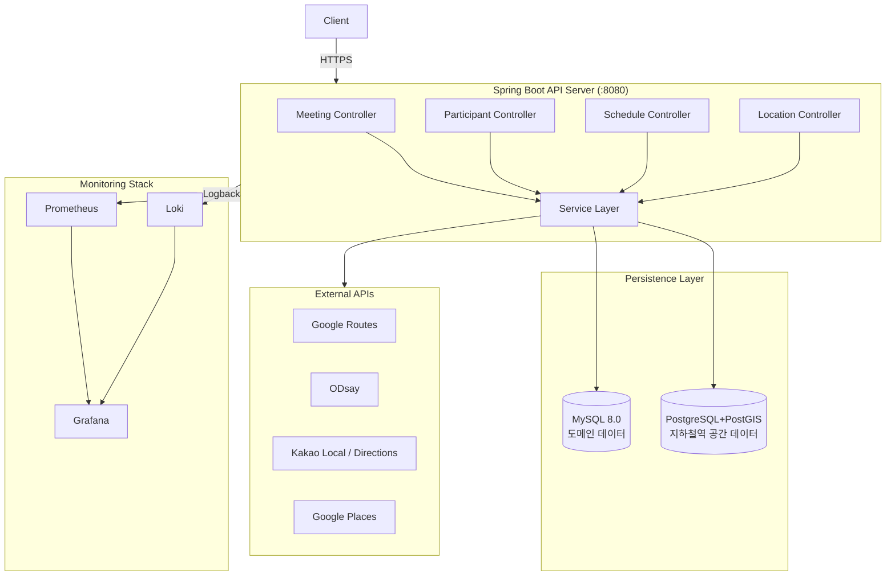

# README 이전 버전: MySQL + PostGIS 분리 구성

> 이 문서는 DB 일원화 이전 README의 인프라 기준을 별도로 보관하기 위한 기록입니다.
> 현재 운영 기준은 루트 [`README.md`](../README.md)와 [`local-dev-setup.md`](local-dev-setup.md)를 확인합니다.

## 보관 기준

- 대상 시점: PostgreSQL+PostGIS 단일 DB 전환 이전
- 도메인 데이터: MySQL 8.0
- 공간 데이터: PostgreSQL 15 + PostGIS 3.3
- 지하철역 공간 데이터 초기화: 별도 `postgis-init.sql` 배포/실행
- Spring datasource 구성: `primary`/`secondary` 분리 설정

## 당시 기술 스택 차이

| 분류 | 이전 구성 | 현재 구성 |
|------|-----------|-----------|
| Domain DB | MySQL 8.0 | PostgreSQL 15 + PostGIS 3.3 |
| Spatial DB | PostgreSQL 15 + PostGIS 3.3 | PostgreSQL 15 + PostGIS 3.3 |
| Datasource | primary/secondary 이중 datasource | Spring Boot 자동 구성 단일 datasource |
| Schema 관리 | JPA DDL + 별도 PostGIS init SQL | Flyway `V1`/`V2` 마이그레이션 |
| Local 실행 | MySQL, PostgreSQL+PostGIS, Redis 직접 기동 | spring-boot-docker-compose가 PostgreSQL+PostGIS, Redis 자동 기동 |

## 이전 시스템 아키텍처



## 이전 로컬 실행 방식

```bash
# 1. 인프라 컨테이너 실행
docker-compose up -d mysql postgres redis

# 2. Spring Boot 실행 (local 프로파일)
./gradlew bootRun --args='--spring.profiles.active=local'
```

## 이전 DB 접속 정보

| DB | Host | Port | Database | User | Password |
|----|------|------|----------|------|----------|
| MySQL | localhost | 3306 | moyeolak | moyeolak | moyeolak |
| PostgreSQL+PostGIS | localhost | 5432 | moyeolak_spatial | moyeolak | moyeolak |

## 현재 문서로 이동

- 현재 README: [`../README.md`](../README.md)
- 로컬 개발 가이드: [`local-dev-setup.md`](local-dev-setup.md)
- 운영 DB 일원화 전환 절차: [`db-consolidation-runbook.md`](db-consolidation-runbook.md)
