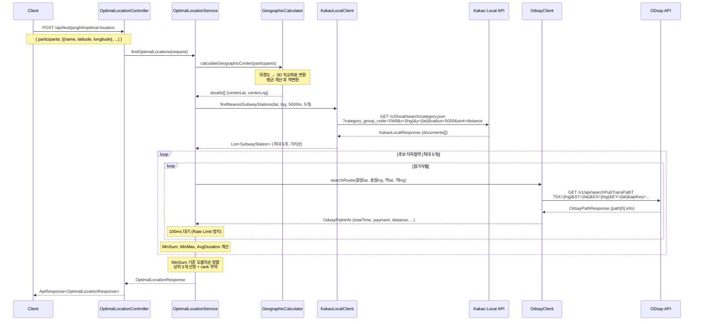

# 최적 만남 장소 추천 시스템 구조 및 동작 흐름

## 시스템 구조

```
┌─────────────────────────────────────────────────────────────────┐
│                         Client (POST)                           │
│              /api/test/janghh/optimal-location                  │
└──────────────────────────┬──────────────────────────────────────┘
                           │
                           ▼
┌──────────────────────────────────────────────────────────────────┐
│  OptimalLocationController                                       │
│  - 요청 검증 (@Valid)                                             │
│  - ApiResponse<T> 래핑 응답                                       │
└──────────────────────────┬───────────────────────────────────────┘
                           │
                           ▼
┌──────────────────────────────────────────────────────────────────┐
│  OptimalLocationService                                          │
│  ┌────────────────────┐  ┌──────────────┐  ┌──────────────────┐ │
│  │ GeographicCalculator│  │ KakaoLocal   │  │ OdsayClient      │ │
│  │ - 중심점 계산        │  │ Client       │  │ - 대중교통 경로   │ │
│  │ - 거리 계산          │  │ - 지하철역    │  │   탐색            │ │
│  │   (Haversine)       │  │   검색        │  │                  │ │
│  └────────────────────┘  └──────┬───────┘  └────────┬─────────┘ │
└──────────────────────────────────┼──────────────────┼────────────┘
                                   │                  │
                                   ▼                  ▼
                        ┌──────────────────┐  ┌─────────────────┐
                        │  Kakao Local API │  │  ODsay API      │
                        │  (카테고리 검색)   │  │  (경로 탐색)     │
                        └──────────────────┘  └─────────────────┘
```

## 패키지 구조

```
com.dnd.moyeolak
├── global/client/
│   ├── kakao/
│   │   ├── config/KakaoApiConfig.java      ← RestTemplate Bean + API Key
│   │   ├── dto/
│   │   │   ├── KakaoLocalResponse.java     ← API 응답 매핑
│   │   │   └── KakaoDocument.java          ← 장소 정보
│   │   └── KakaoLocalClient.java           ← 지하철역 검색 클라이언트
│   │
│   └── odsay/
│       ├── config/OdsayApiConfig.java      ← RestTemplate Bean + API Key
│       ├── dto/
│       │   ├── OdsayPathResponse.java      ← API 응답 매핑
│       │   ├── OdsayPathInfo.java          ← 경로 요약 (시간, 거리, 요금)
│       │   └── OdsaySubPath.java           ← 경로 세부 구간
│       └── OdsayClient.java               ← 대중교통 경로 탐색 클라이언트
│
└── test/janghh/
    ├── controller/
    │   └── OptimalLocationController.java  ← POST 엔드포인트
    ├── service/
    │   ├── OptimalLocationService.java     ← 핵심 비즈니스 로직
    │   └── GeographicCalculator.java       ← 지리 계산 유틸
    └── dto/
        ├── request/
        │   └── OptimalLocationRequest.java
        └── response/
            ├── OptimalLocationResponse.java
            ├── CenterPoint.java
            ├── SubwayStation.java
            ├── EvaluatedPlace.java
            └── RouteDetail.java
```

## 시퀀스 다이어그램



## 처리 단계 상세

### Step 1. 중간지점 계산 (GeographicCalculator)

참가자 좌표의 지리적 중심점을 구한다. 지구 곡률을 고려하기 위해 위경도를 3D 직교좌표로 변환 후 평균을 구하고 다시 위경도로 역변환한다.

```
위경도 → (x, y, z) 직교좌표 변환 → 평균 → 역변환 → 중심 위경도
```

### Step 2. 후보 지하철역 검색 (KakaoLocalClient)

Kakao Local API의 카테고리 검색(`SW8` = 지하철역)을 사용하여 중심점 반경 5km 이내의 지하철역을 거리순으로 최대 5개 조회한다.

### Step 3. 이동시간 평가 (OdsayClient)

각 후보역에 대해 모든 참가자의 대중교통 이동시간을 ODsay API로 계산한다. 평가 지표:

| 지표 | 계산 | 목적 |
|------|------|------|
| **MinSum** | Σ(참가자 이동시간) | 전체 효율성 최대화 |
| **MinMax** | Max(참가자 이동시간) | 공정성 확보 |
| **AvgDuration** | MinSum / 참가자수 | 평균 이동시간 |

### Step 4. 추천 결과 반환

MinSum 기준 오름차순 정렬 후 상위 3개 역을 추천한다.

## API 호출 횟수 예시

6명 참가자, 5개 후보역 기준:

| API | 호출 횟수 |
|-----|----------|
| Kakao Local (지하철역 검색) | 1회 |
| ODsay (경로 탐색) | 5역 × 6명 = 30회 |
| **합계** | **31회** |

## 요청/응답 예시

### Request

```http
POST /api/test/janghh/optimal-location
Content-Type: application/json

{
  "participants": [
    { "name": "김수아", "latitude": 37.497, "longitude": 127.027 },
    { "name": "이준수", "latitude": 37.566, "longitude": 126.978 },
    { "name": "박민지", "latitude": 37.513, "longitude": 127.100 }
  ]
}
```

### Response

```json
{
  "code": "OK",
  "message": "요청이 성공했습니다.",
  "data": {
    "centerPoint": {
      "latitude": 37.525,
      "longitude": 127.035
    },
    "recommendations": [
      {
        "rank": 1,
        "name": "강남역 2호선",
        "category": "지하철역",
        "address": "서울 강남구 역삼동 825",
        "latitude": 37.498,
        "longitude": 127.028,
        "distanceFromCenter": 523,
        "minSum": 85,
        "minMax": 35,
        "avgDuration": 28.3,
        "routes": [
          {
            "participantName": "김수아",
            "duration": 15,
            "distance": 5200,
            "payment": 1250,
            "transitCount": 0
          },
          {
            "participantName": "이준수",
            "duration": 35,
            "distance": 12800,
            "payment": 1400,
            "transitCount": 1
          },
          {
            "participantName": "박민지",
            "duration": 35,
            "distance": 11500,
            "payment": 1400,
            "transitCount": 1
          }
        ]
      }
    ]
  }
}
```

## 설정

`application-local.yml` / `application-prod.yml`에 API 키를 환경변수로 주입:

```yaml
kakao:
  api:
    key: ${KAKAO_API_KEY}
odsay:
  api:
    key: ${ODSAY_API_KEY}
```

`.env` 파일에 실제 키 설정 후 `./gradlew bootRun`으로 실행.
